# ACUMEN

This was a team game design project for a 2D psychological RPG game built in Unity.

Included are the code files I contributed as the programmer, my team mate was responsible for the art design and asset creation, audio design, and story design. This summary is from our final game design submission and we both contributed to the following documentation.

This code is for a prototype with two levels demoing the environment interaction and inventory systems, dialogue management system, user feedback messages, puzzles, and NPC interactions. Below is a brief concept summary of the game.

## Concept Summary:

ACUMEN is a story-based psychological RPG available on PC where you play as Nyx, a university student who awakens in a bizarre place – brick walls, concrete floor, and the sickening smell of an overuse of cleaning products. As they struggle to regain their composure and what little memory they have, the silhouettes of other people begin to appear. Soon, they learn the others are in a similar situation – no memory, a little pain and, most of all, an overwhelming panic when no escape becomes evident. You play through puzzles and crack riddles to find an exit, learning more about the people who now surround you.

Depending on the characters you choose to learn more about, those whose decisions you back, and those who you choose to betray, the more different the path you lead will be. The paths you will guide your peers on may even take their lives from you. Be weary.
ACUMEN takes the trapped in a room full of strangers trope and turns it on its head – instead of the promise of an escape back into one’s normal life, the paths are the promise of an escape to one’s death.

Futility is a funny thing, right?

## Presentation of the target audience/market analysis.
Because of the approximately even gender split in RPGs (60:40 M:F according to Clement (2021)), it is hoped this game will reach a variety of audiences. The large cast of NPCs spans abilities, races, sexualities and more, so it is hoped each player has at least one person the player will relate to as players have suggested more diversity in these categories (60%, 58% and 48% respectively – IGEA 2021:56).

ACUMEN is played best with larger periods of time in order to be absorbed into the story, which coincides with the 83 minute average daily play time for Australians (IGEA 2021:21). Men typically play daily for slightly longer (90 minutes, IGEA 2021:21) which works with the 53% of gamers who are male (IGEA 2021:17), meaning the longer play time will suit the majority gender of players.

In addition, approximately 1% of Australian players are nonbinary (IGEA 2021:17) and 57% of players call for more gender diveristy in video games (IGEA 2021:56). The protagonist Nyx is nonbinary, which would likely bring in players who otherwise wouldn’t play similar games, as gender diversity is important representation that people would be excited to see.

## A description of the game setting/story
The world is intentionally left vague – the premise of the game begins in an escape room scenario, with puzzles to solve and people to learn about. However as the game progresses, items and hints from NPCs reveal the truth about where they are – every character has been dead since the start, and Nyx’s relationship with each NPC dictates their fate.

Nyx is an interesting protagonist as they play into the amnesiac trope, unable to remember much before waking up in the building. In the end they turn out to be the “judge” of the fates of the NPCs, and have been for many iterations of this world. That’s where the name of the game comes from – “acumen” meaning the ability to make judgements and quick decisions.

Each character has their own backstory which affects their personality and how they react to the situation they find themselves in. An example is that of Scarlett, the down-to-earth, pragmatic character who helps Nyx along the way. Scarlett was a young nurse working for MSF. She was raised by a single parent who had a lot of insecure jobs, so was looking for a stable career where she would always have a job. She was enjoying her job as she loved helping people but looking to move into something less busy as she is planning to get married and have kids in a few years. She has lost a lot of people in her life (sister to a motorcycle accident, best friend growing up to suicide).

## Gameplay
The core gameplay for ACUMEN is as follows:
1.	The player will control an avatar who progresses through levels by solving puzzles and making decisions when prompted.
2.	In each level, there are multiple rooms with access blocked by locked doors. The player must solve mini-puzzles to unlock the doors.
3.	Levels are populated with items, which can be picked up and used (either to solve puzzles or increase trust with the NPCs).
4.	There is a cast of NPCs who progress through the story with the player, who will help or hinder them based on the trust resource mechanic
5.	NPCs can be interacted with through a dialogue system to impact the trust resource.
6.	Major puzzles which end a level will feature cutscenes and Nyx will make decisions about the NPC’s fates.
### Gameplay elements and mechanics
* Each level is instantiated only once per playthrough.
* Acumen is a single player game.
* Rooms are only visible when they are accessible. Once the door is unlocked, the player can proceed to the next room. Depending on the part of the story, leaving a room may make it inaccessible.
* The sequence and layout of level rooms is determined by the story and levels will not feature any random generation of objects.
* The player moves through the rooms by WASD movement.
* The player interacts with items, doors, and NPCs via ‘e’, the interact button.
* The items have a type, which dictates their behaviour, and some other properties (e.g. a code box item will have a code property, a key will have a door it corresponds to).
* The inventory system holds the items and some items can be used by opening the inventory and clicking on them (e.g. clicking on a code box will prompt you to enter the code to open it).
* The NPCs are a cast of characters who will follow the player character through the story. Interacting with them opens the dialogue system.
* The dialogue system can influence the data and inventory systems, thus the dialogue system will notice if the player character has a lost item in their inventory and prompt them to return it to the owner if they wish to do so.
* Choices in the dialogue system impact trust, which is stored as a variable on the NPCs.
* The data file system contains information on the NPCs, it updates based on the dialogues. For example, speaking to an NPC without learning their name means they will display as ‘???’ until you learn their name through the dialogue system.
* The inventory and data systems display information when the player hovers the mouse over the field.
* Doors require either a key or a puzzle to be solved to open to the next room.
### Goals and constraints
The goal is for the player to complete the story by progressing through each level. They are permitted to make choices in the game via the dialogue system and final level-end puzzles, enabling the player to have a different experience each playthrough. The final game will be populated with clues about the game lore in hard-to-find dialogue options and items, suiting players who like to explore and put together clues. An example is the coin item found in the first room, which is a reference to the obol paid to Charon when crossing the river to death. This hints that the player and the NPCs are all dead (which isn’t revealed until the end of the game).
### Achievements
As the game features exploration as one of the main goals, achievements will be linked to finding secret items. Other achievements will be given when the player achieves maximum trust with an NPC. Since it is impossible to do this with every NPC in one playthrough, this will encourage repeat plays. Following the release of the game, a social media manager could encourage the development of a wiki which will further increase engagement with players who enjoy discovering game secrets to be able to share them on a wiki.
### Game options
The gameplay is simple and so there will not be multiple modes of play and there is no need for a tutorial. Placing a simple game controls guide somewhere in the game menu will handle players who need help understanding the controls. The UI system currently displays messages in addition to the use of a standard set of controls (WASD for movement with a mouse click to interact with the UI).

Since the story will be long, the game will have a save file feature allowing players to save their progress and continue at a later time. There will be the capacity for multiple save files so players can save before difficult puzzles or return to an earlier point in the story should they wish to.
## Worksheet summary
### Feedback and internal economy worksheet
We used this worksheet to explicitly describe the relationships between story progression and the internal game economy. This allowed us to build the narrative with consideration for game balancing and the flow of the various resources.

The internal game economy consists of tangible resources (puzzle items, lost items, and NPCs) which can be found and interacted in the game world through the inventory system. There are also intangible resources (trust and space), the most important of which is trust. The player can affect the trust resource indirectly by either agreeing with the NPC or returning items to raise trust. Disagreeing with the NPC or choosing unfavourable dialogue options will lower trust.

Positive and negative feedback is mainly provided by the NPCs as some NPCs have more agreeable personalities and will help the player in the early levels by beginning with a starting trust level. As the game continues, Nyx’s choices will affect the trust levels. NPCs will have conflicting goals, meaning the player must choose which NPCs to side with, limiting their access to help as the game continues. The NPCs might die, providing further negative feedback at the end of the game to make the final levels more challenging.

### Feedback and balance worksheet

This worksheet was used to determine how our game will meet the needs of the players to feel engaged, challenged, and other needs according to their player type. We used this worksheet to determine a schedule and action plan for user testing to ensure our final game product is balanced and provides an engaging experience for all players.

## A description of the Art Design (visual and audio)
### Visual direction
The game is in a 8-bit style, especially the character sprites. The feel is not quite trying to emulate older style games, but arcade games definitely have an influence as seen in the pixel art style. Key art influences for ACUMEN are Undertale, House and Your Turn To Die.
### Environment description
The environment is quite plain; white tiles, tinted walls, etc. As the game is heavily character-based the NPCs’ bright colours, along with items on the ground, are the main focus. It is meant to give the player a sense of hopelessness as the characters feel. It is, in essence, a blank slate for the player to write their version of the world on by interacting with NPCs and solving the puzzles. 
### Audio direction
The audio design is quite simple. The music is calm ambiance, reflecting the room that the cast has found themselves in. It is neither too upbeat nor scary, as the characters are still trying to figure out where they are, and what they are doing there. Footsteps that echo are heard when moving Nyx around, reflecting the emptiness of the room and instils a sense of overwhelm and despair.
###  Concept art
_First iteration of Nyx’s walk cycle, later updated to be smoother._

### Reference Art

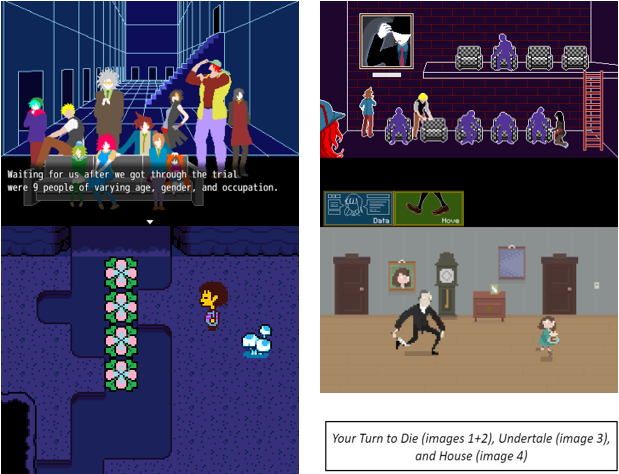

### Game characters
There is a large cast of characters to choose from. While they all are under 50 or so years old, the age range within that is large with people of varying personalities, races, genders, etc. This is so the players are more likely to find a character they like or relate to, which will push the story forward. Every character has lore and it is up to the player to decide whose story to explore. 

Nyx, the main character, is a mix of a blank slate and a proper character. A lot of video game protagonists are a complete blank canvas for the player to project themselves onto, while some have full stories. Nyx is a healthy mix of both: while they have less of a lore than the NPCs so the player can project themselves or “put themselves in Nyx’s shoes”, Nyx also has their own personality and morals. It is up to the player whether they follow Nyx’s ethics or their own.

Each NPC has a trust level that determines how they interact with Nyx, adding another layer for certain players (e.g. getting every character to like/hate them).

### Storyboard
The storyboard shows the rough idea of Nyx waking up, solving a puzzle and talking to the NPCs and collecting information on their files.

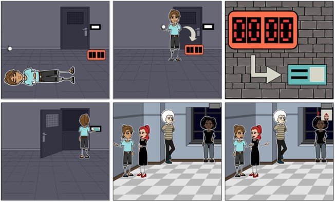

_read left to right ; top row first :)_

## User Interface

Overall design for the UI will be very simple, with a sans serif font on a dark semi-transparent panel used for most UI elements.

### In Game UI Design

The UI design will be very simple, in line with the game’s aesthetic, with descriptive text on top of rectangles for most buttons. There will be two buttons, ‘Inventory’ and ‘Data’, located in the top right of the screen, as well as a menu button in the top left. There is no need to display any skills or score data in a HUD for this game.

* Inventory: where the player can click to interact with inventory items, which are displayed as simple pixel icons. Hovering over an inventory item brings up an information window next to the inventory with more detailed information. The player can click on some items to interact with them.
* Data: the player can read the files created for NPCs they have interacted with. The NPCs are listed by name, and their data file will have a pixel art image of the character.

### Out of Game UI design

The menu will consist of the game title displayed above text buttons on a black panel, clickable to do either Load save, New game, Settings (containing options for rebinding controls) or Quit. Each submenu will look much the same, with a lower text option containing ‘Return to main menu’.

### Controller/ Controls Design

The game is designed to be played on PC with a combination of keyboard controls for movement and interaction with the game world, and clicking to complete puzzle mechanics or interact with the UI. It will be possible to port the game to game consoles, but not mobile games due to the game mechanics. The player will control a sprite for their avatar (viewable above in the Design section), since this is an RPG game. This will allow the player an immersive experience in the game world, and to develop an emotional connection with the avatar.

### Level design
The level design completed for the prototype covers most of the core gameplay for the final product, with the exception of the level-end cutscenes where Nyx makes decisions.
### Menu
 The prototype menu is shown here with the option to play a game or quit. It showcases the art style (simple, pixel art created by our art designer) and the atmosphere created by the use of mysterious music (open source). It doesn’t yet feature the save/load system.

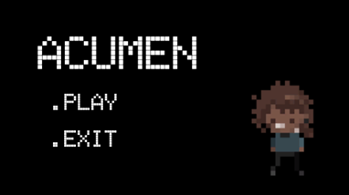

### Opening cutscene

The opening cutscene plays through using the dialogue system, where the dialogue shows Nyx’s thoughts as they awaken in the room. In the future this could be developed to also have an animation playing illustrating the scene as depicted in the storyboard. The level 1 music begins here, also [open source](https://uppbeat.io/track/kevin-macleod/lightless-dawn).

### Level 1, Room 1
Nyx is alone in the first level and there is a door puzzle using the Inventory system.

Nyx can collect the items around the room to solve the puzzle. The art assets for the tiles were created by Buch and are open source, the item sprites are also open source. The player can walk around the room using WASD. The inventory and data system can be viewed by clicking either of the UI buttons at the top of the screen.

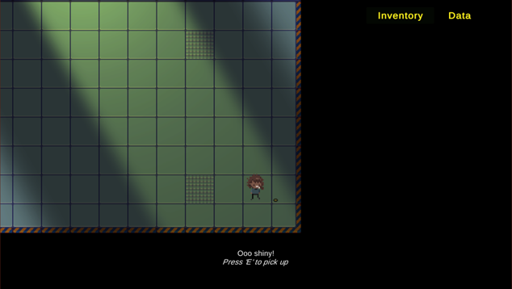

UI messages display to prompt the user when they are in range of an item, and to teach them the Interact command, ‘E’ which can be used to interact in the game world.

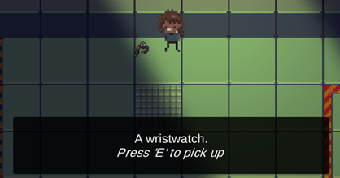
 
**_Inventory system features_**

Clicking on the inventory to open it, the player can access information about items by hovering the mouse pointer over that inventory slot. They can interact with them if they are ‘usable’. In this room, only the code box is usable. Clicking the code box opens up a custom code box UI.

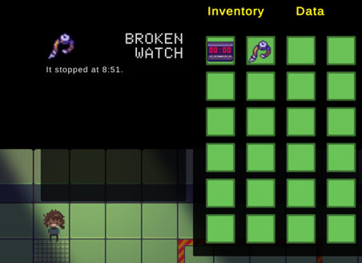

Once the player opens the code box (by inputting the time displayed on the broken watch in 24-hour time, so ‘2051’) the card key appears in their inventory and a success sound plays.

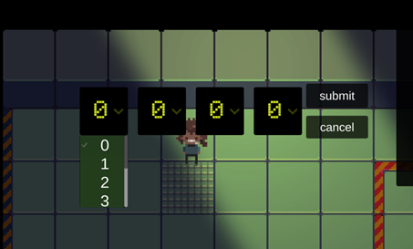

The card key appearing in the inventory also changes the door UI message, prompting the player to open the door.

They can then proceed to the next area by walking to Room 2.

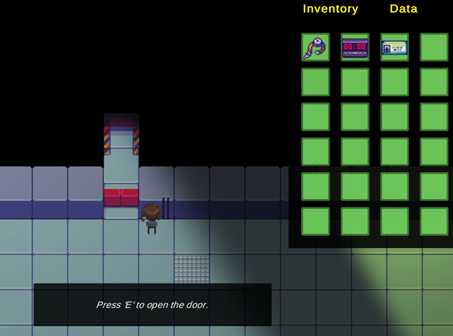
 
### Level 1, Room 2

After walking to Room 2 there are NPCs who can be talked to.

This room showcases the dialogue system, which is not needed to solve the door puzzle but the player can get a hint.

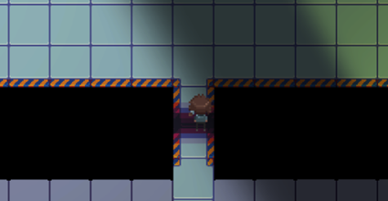

***Dialogue system features***

The Dialogue system UI will update the UI when the player learns an NPC’s name.

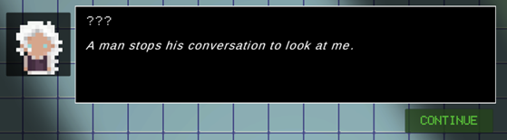

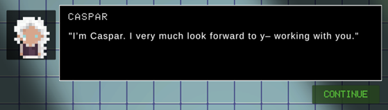

The Data system panel will also update dynamically based on whether the player knows an NPC’s name. If they just talk to them without learning their name, it will display as ‘???’.

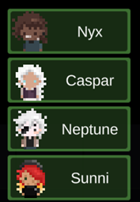

Conversations with NPCS can also change based on whether you have met a different NPC already. Below are two versions of the conversation with Caspar, one where you first talk to Neptune and thus know his name already.

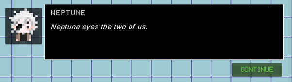

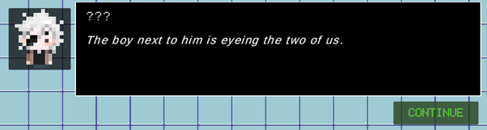

The dialogue system will prompt the player to make choices, which changes the trust levels, thus changing the repeat dialogue. Below you can choose to team up with Olive, and her repeat dialogue variable will change accordingly with her trust value.

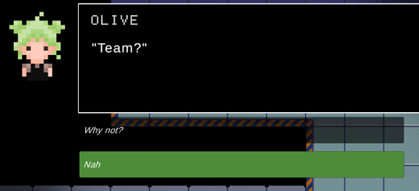

High trust:

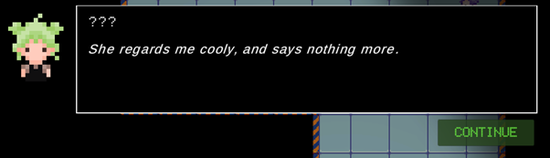

Low trust:

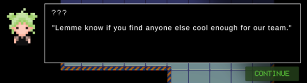

If Nyx has picked up the corresponding item for a NPC, the dialogue system will prompt the player to return items, which can give hints for the puzzles. In room 1 there is a ring the player can pick up and return to Acacia.

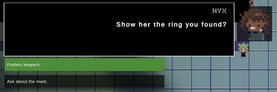

If the player returns the item, her repeat dialogue will change to give the player a hint for the door puzzle. 
Her Data file also updates based on the player’s actions.

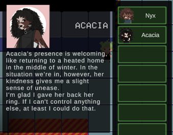

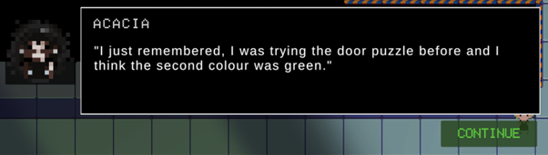

The UI will also show custom messages when you approach the NPCs.

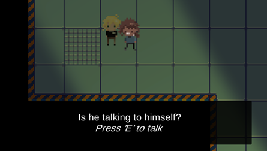

The door puzzle is accessed by interacting with the door panel, which will open a custom puzzle UI. 

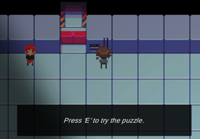

The player can click a button, which will play a sequence of coloured boxes. They must give the correct colour sequence to open the door, but only have three possible plays. They have unlimited guesses, and can return the ring to Acacia to get a hint.

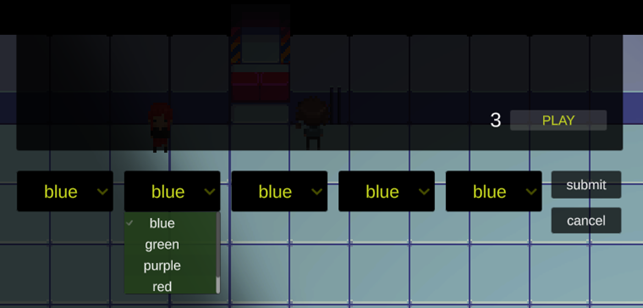

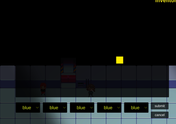

In the final version of this game, the colour sequence should be randomised each playthrough to avoid the player from using their memory or guides to complete it. The art assets for this puzzle were created with simple box sprites (shown to the right) but the release game will feature more appealing art depicting a computer panel.

Completing the puzzle opens the door and finishes the prototype game.

## Detail of the Technical Design

### Requirements Analysis

1.	Technical hardware

The game is intended for use on PCs with possible future console ports. Since the art and gameplay style are both simplistic, the requirements for graphics, CPU and RAM will all be quite light and it should be playable on all modern PCs.

2.	Technical software: engine

We selected the Unity engine as the programmer had experience working with this engine before, and it is suitable for a game with puzzle mechanics such as ACUMEN. It is also more accessible than other game engines used in this genre such as RPG Maker, as it has a free entry-level option.

3.	System intelligence

The game does not require the use of AI, as the puzzles in the game will consist of using clues found in the game world, help from the NPCs, and in some situations probability to deliver the player a unique game experience each playthrough.

4.	Data management/ support

Player data will be saved in a JSON format locally to the player’s PC or console memory device, or on any cloud service provided by stores where the game is sold (such as Steam’s).

### 2D/ 3D graphics

This game is a 2D game with a simple, top down style. All game entities will be 2D, with simple material textures for the sprites.

### Animations

The game characters (Nyx and the NPCs) will be hand animated through the use of the sprites, with animations for idling, walking, and reactions during conversations. This is essential for the theme of empathy, as the game aims for the player to connect emotionally with the characters. The camera will be animated during cutscenes staged at major events in the story, but will not be part of the main game play. These scenes will use hand drawn art to illustrate the NPC reactions in more detail, so sprite animation is not necessary. The camera animation will be created through Unity’s built in system.
## References
Bark Bark Games (2022) _[House](https://barkbarkgames.itch.io/house) [online]_ itch.io, accessed 27th March, 2022.

Bartle R (1996) Hearts, clubs, diamonds, spades: Players who suit MUDs. _Journal of MUD Research_, 1(19).

Brand JE, Jervis J, Huggins PM and Wilson TW (2021) _[Digital Australia 2022]_(https://igea.net/wp-content/uploads/2021/10/DA22-Report-FINAL-19-10-21.pdf) [online], Eveleigh, IGEA, accessed 28th March, 2022.

Clement J (April 30th, 2021) _[RPG gaming app audiences in selected markets as of December 2019 by gender]_(https://www.statista.com/statistics/1224506/rpg-gaming-app-audiences-select-countries/) [online] Statista, accessed 28th March, 2022.

vgperson (n.d.) _[Your Turn to Die]_(https://vgperson.com/games/yourturntodie.htm) [online] accessed 28th March, 2022.

## Feedback and Internal Economy Worksheet and Checklist
_Review the internal economy and feedback mechanisms identified for your game design in the Rules Worksheet. Update these in the table below to reflect refinements made while creating your game._
#### Resources used in the Internal Economy
|Name of resource|How it is used in the game|
|-----|------|
|Tangible: Puzzle items such as door keys|Players spend these items to solve puzzles. (Other inventory items can be collected to learn more about the lore, and these items are not differentiated in the inventory)|
|Tangible: Lost items|Players can return these items to the NPC in exchange for information or trust. Some of these items can also be used to solve puzzles.|
|Intangible: trust|Every story you learn from each NPC, the more you learn about them, will increase the trust between Nyx and the NPC. The value is never shown directly, but more information on their file appears. The NPC will behave differently based on whether they have high or low trust of Nyx.
This also relates to the theme of ‘empathy’ as a key mechanic of the game relates to understanding the perspectives of the interactive NPCs.|
|Intangible: space|The rooms the player has access to. The player will gain access by successfully solving puzzles, allowing them to find more items. Access might be lost as part of the story.|
|Tangible: NPCs|Other characters who offer information, who can be killed if a puzzle is not solved optimally.|

#### Feedback mechanisms
|Type of feedback (positive/negative/random)|Input resources (amount of feedback depends on quantity  of these resources)|Output resources (resource whose level is changed as a result of this feedback)|Goal of this feedback mechanism|
|-----|------|-----|------|
|Positive|As the player gains more access to the playable space, they can access more items to learn about the lore, gain trust, and solve puzzles. The more information they learn about the NPCs and the higher the trust gets, the more help they will receive during the puzzles.|Puzzle items, lost items, trust and space|Allow the player to solve puzzles while spending fewer items, increasing what they can exchange for trust. The player can also progress through the story and learn more lore about the game world.|
|Negative|Spending items to solve puzzles rather than returning the item to the NPC will cost trust. NPCs who mistrust Nyx will not offer help and might even hinder their progress. NPCs who die in puzzles cannot provide help.|Lost items, trust|The player must make choices about how to spend their resources, allowing them to have a different experience during different playthroughs.|
|Random|Lost items: Some dialogue from NPCs will be randomly triggered giving Nyx a chance to return lost items.|Trust|Offers extra lore and opportunities to gain trust and makes the playthrough experience different each time.|

#### Part 2: Economy
The game rooms are limited sources, functioning as engines to provide the player with new items to find and collect. The items that will appear in the room are limited and new items will not appear after the room has first been entered.

Conversations with the NPCs can allow for conversion processes, as converters are often entities too (Adams 2014). If the player learns which items they have lost, including the extra random side quests, they can exchange those items for trust with the NPC.

The puzzles function as drains and sources, requiring items to be spent to be solved but giving access to more space (game rooms) upon successful completion. Items spent in puzzles are permanently removed from the game.

Reflecting on our game’s economy has made us aware of the introduction of resources through sources. Since our game has limited sources, there will need to be playtesting to ensure that there are sufficient resources for player’s to experience the game as fair when playing the game. Adjusting the game’s economy could take the form of adding additional items, or draining resources further through spending items in the puzzles. We can also intervene by adding more group conflict into the NPCs to force the player to choose more carefully which NPC they develop trust with.

### References:

Adams E (2014) Fundamentals of Game Design. Berkeley, California: New Riders (Voices That Matter).

## Feedback and Balance Worksheet and Checklist

#### Balance considerations

_Describe your game in terms of fairness? What attributes (feedback, mechanics, action) make it fair?_

The game uses the positive and negative feedback mechanisms to ensure that the players experience the game as fair. This help comes in the form of information (hints) and interventions in puzzles to make the difficulty lower. For example, during a memorisation puzzle an NPC will assist Nyx by sharing some of the pattern that needs to be memorised. It is beyond the scope of this project, but there are plans to implement timer-based assistance from the system in addition to the help from the NPCs. This ensures that players do not experience stagnation too often in the game.

_Are the feedback mechanisms described above well placed throughout the game?_
This will need to be playtested as each level and puzzle is built. In each level there will be opportunities to raise trust with NPCs and gain their help, which will sometimes come at the cost of losing trust with another NPC with a differing opinion.
Describe your game in terms of stability? What attributes (feedback, mechanics, action) make it stable?
The first puzzle is easy, allowing the player to learn the basic game mechanics in a low-pressure environment. As the game progresses and the player earns more trust, they will receive more help from the NPCs they have earned trust. A player that does not build trust with any NPCs is also has a valid playstyle, although the puzzles will be more challenging.

_How are resources managed for each player? Are the feedback mechanisms described above well placed throughout the game?_
The tangible resources (puzzle items and NPCs’ lost objects) are pre-determined in terms of placement in the game world. The economy is closed, with no way to generate new resources. This will allow us to adjust the balance quickly in response to playtesting by adding or removing items as necessary. In the long term plans (beyond the scope of the prototype) to implement a hidden items mechanic which will reward exploration.
Describe your game in terms of engagement? What attributes (feedback, mechanics, action) make it engaging?

_What considerations have been made for providing engagement as a component of a fair and balanced game? How are audio and visual cues used to provide information to the game player that may impact upon their fair and stable game experience?_
Our consideration of player experience is based on the PLAY heuristics developed by Desurvire and Wiberg (2009) by focusing on using visceral, audio and visual content to create an immersive experience and emotional connection between the player and the game. The visceral connection is created by having the player control the protagonist’s avatar, and make interact with the in-game world to affect the story of the game. Some of these consequences will involve the deaths of NPCs. The audio content will use music to create a certain mood through auditory ambiance, using sad music after a death or tense music to make puzzle environments more immersive. The visual style is simple, to allow the player to project their own experience of the game world onto. 

Furthermore, our protagonist is from an underrepresented group (nonbinary people) which will increase the novelty and interest in our game for players who enjoy diverse representation.

### Difficulty of your game
|Absolute difficulty|Relative Difficulty|Perceived difficulty|
|-----|------|-----|
|Describe the amount of intrinsic skill required to meet a challenge and stress.|Describe the difficulty of a challenge relative to the player power to meet that challenge.|Describe how the player may  feel about the game challenges.|
|Key puzzle: Player must determine how to use objects in the room to open the door. Memorisation puzzle: Players must memorise a pattern or sequence to be allowed to proceed. Negotiations: Players must choose dialogue options to side with NPCS.|The ability to solve puzzles will depend on the player’s trust levels with particular NPCs. They will give hints if Nyx initiates dialogue with them before finding the key. Negotiations will depend on the amount of time the player invests in getting to know the NPCs, as they may be able to learn things to avoid losing trust with certain NPCs.|Some of the timed puzzles may make the player feel stressed. They may also feel pressure as certain NPCs lose trust and turn against them. |

#### User testing
|Description of user element to be tested|Testing method|Plans for testing|Outcomes|
|-----|------|-----|-----|
|Determination of socialisers, explorers player roles for usage preferences |Character theory (Bartle)|A small pilot beta test of the game will be made available, and a survey using a combination of Likert and open ended questions will be used. Should the initial survey yield useful data, beta testing will expand to gain more data. Open ended answers will be used to generate information about play styles. This will be added to the explorer role, which is expected based on the lore heavy nature of the game.|Some players will enjoy reading the text describing items and interacting with NPCs to learn more about them.|
|Determining other possible playstyles beyond Bartle’s theory|Player types generated by coding user surveys from beta testing||We expect some players will enjoy working with certain NPCs, others will enjoy trying to find a dominant strategy, and we hope to learn more goals for players in the game. |

#### System testing

|Description of system element to be tested|Testing method|Plans for testing|Outcomes|
|-----|------|-----|-----|
|Examining the usability of the game|Heuristic evaluation in line with PLAY|This will use a targeted survey consisting of Likert questions. It will be piloted during the beta testing and the questions refined for use during play testing on the near complete product before release. These questions will target the feedback, clarity of game elements, and seamlessness of experience in like with Category 3.|Players can describe elements of the game system that improve or hinder their engagement|

#### Experience
|Description of experience element to be tested|Testing method|Plans for testing|Outcomes|
|-----|------|-----|-----|
|The experience of solving the puzzles in the game world. Player must be able to play without feeling bored.|Flow theory|This will be used to balance the giving of hints during game play to ensure the challenge does not overwhelm the player. This will be tested during the beta-testing section of the development.|If players describe their experience as frustrating, more hints will be added. If they complete the game too quickly, hints will be removed.|
|The achievement system, particularly for the hidden item mechanic|Bartle’s Character Theory – Achievers|This will also include the addition of the achievements system, in line with Bartle’s Character theory. Surveys during playtesting in addition to statistics provided by the Steam (or other) platform will indicate which achievements are providing engagement.Gaining the achievements will be appealing to those with a “completionist” mindset, and strive to replay the game often to complete every possible achievement and view each NPC’s potential ending. The statistics collected by the game regarding replays will inform this.|Achievements may unlock rare interactions with certain NPCs, along with completing certain side quests.|
|Player must decide the paths for the NPCs and feel as if their decisions have a real impact on the path of the game. |Bartle’s Character Theory – Socialisers|This impact will be measure using a range of things - questions during the surveys, statistics about the final NPCs present in the last level of the game, and social media interaction that mentions the NPCs. Ideally, there should be a balance of interest in each NPC. Less interest indicates an NPC who needs more character development (lore) or balancing.|By the true ending of the game, only four NPCs will remain (along with Nyx). These NPCs will be ones that the player has interacted with in certain ways and built trust with.|

#### References:
Desurvire H and Wiberg C (2009) Game Usability Heuristics (PLAY) for Evaluating and Designing Better Games: The Next Iteration, Conference: Online Communities and Social Computing, Third International Conference, OCSC 2009, DOI:10.1007/978-3-642-02774-1_60.
